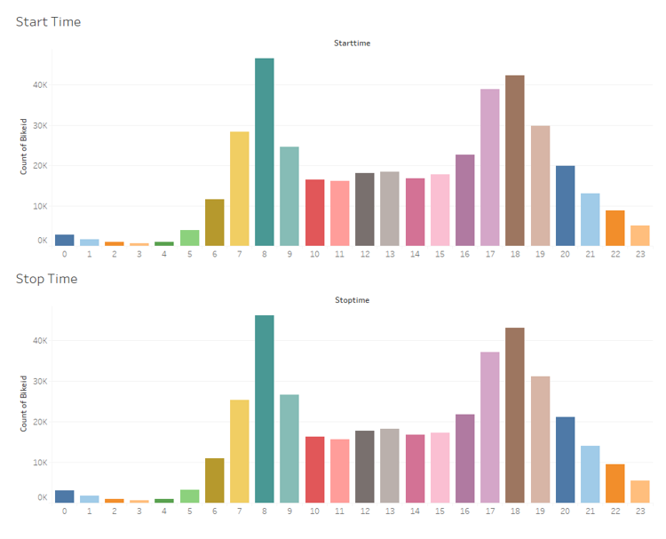

# Citi Bike Analytics
#### by Sushant Deshpande

I did my analysis for the year 2019.

I started with downloading the data from CitiBike’s website (https://s3.amazonaws.com/tripdata/index.html).

• Files there were split into months so I merged them in Jupyter Notebook to get one file for the year 2019. In this way, it will be easy for Tableau to analyze the data.

• I started with the popularity of the station over the period of 12 months. We can select one, many or all the stations from the dropdown menu on the right. The visualizations show that Grove ST PATH is the busiest in the month of August through October.

• Now, let's see what are the most common times when people like to use bikes. From these bar graphs, we can see the morning 8 am and evening 5 and 6 pm are the busiest times when most people prefer to rent a bike. Also, these are the busiest times when they also like to return the bikes that they rented suggesting that they take short commute.

• Let’s compare number of bikers in summer and winter to see which season is busier and at what times. From these graphs, we can also see that the busiest hours during summer and winter seasons. In both those season, 8 am, 5 pm and 6 pm still remain the busiest times but, we see a drop in the number of total bikes being rented. In summer, the total number of rented bikes is more than 25K and in winter, it is less than 20K.

• Now let's see which are the top 10 and bottom 10 stations from where bikes are rented. From this visualization, it is clear that these are the 10 stations that are the busiest. Hence, they should have more bikes available to meet the demand. Whereas, if we look at the bottom 10 stations, we can see that these would be the one that would need further investigation as to why they are least popular. There might be a chance that they might be malfunctioning suggesting a repair.

• Who likes to bike more, male or female? This question is answered in this visualization. As we can see, there are more than 33K male bike riders as compared to around 12K female bike riders in the month of September.

• Now, let's try to visualize geographically which are the busiest starting and stopping stations over a period of 12 months. With the help of the slider on the right, we can choose any or all the months to display the data and visualize it on the map.

